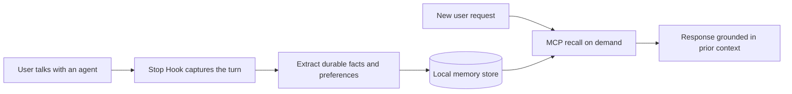

<!-- Generated from docs/content/readme-content.json by scripts/render-readme.ts. Do not edit directly. -->

# memware

[简体中文](README.zh-CN.md)

**Give AI agents long-term memory without making users repeat themselves.**

memware is a local-first long-term memory layer for MCP-compatible agents. It distills conversations into durable, searchable memory and recalls relevant context in later tasks. Memory stays on the user's machine, while extraction and embedding use the OpenAI-compatible model endpoint the user chooses.

> **Status: pre-release.** Source, tests, and local binary builds are available. The npm package and GitHub Release are not public yet, so use the source path below today. `npx memware` will become available with the first public release.

## Why memware

- **Automatic writes**: A Claude Code Stop Hook captures each completed turn, so persistence does not depend on the model remembering to call a tool.
- **On-demand recall**: Seven MCP tools cover status, warmup, context retrieval, processing, search, archive, and reset.
- **User-owned storage**: Structured memory, vector indexes, and audit logs live under a local data directory.
- **Provider choice**: Extraction and embeddings use configurable OpenAI-compatible endpoints instead of a single locked provider.



## Try it today

The current source path requires [Bun](https://bun.sh), Claude Code, and an API key for an OpenAI-compatible endpoint.

### 1. Clone, verify, and build

```sh
git clone https://github.com/HackSing/memware.git
cd memware
bun install
bun run test
bun run typecheck
bun run memware:build
```

### 2. Register the MCP server

Apple Silicon macOS:

```sh
claude mcp add memware \
  -e MEMWARE_API_KEY="$MEMWARE_API_KEY" \
  -- "$PWD/dist/memware/memware-darwin-arm64" serve
```

Linux x64:

```sh
claude mcp add memware \
  -e MEMWARE_API_KEY="$MEMWARE_API_KEY" \
  -- "$PWD/dist/memware/memware-linux-x64" serve
```

Call `memory_status` in Claude Code to verify the server. For a custom endpoint, also configure `MEMWARE_BASE_URL`, `MEMWARE_MODEL`, `MEMWARE_EMBEDDING_MODEL`, and the matching embedding dimension. Use `MEMWARE_EMBEDDING_BASE_URL` for a separate embedding endpoint and provide `MEMWARE_EMBEDDING_API_KEY` when it uses a different origin.

### 3. Enable automatic memory

Merge [`packages/memware/templates/claude-settings-hooks.json`](packages/memware/templates/claude-settings-hooks.json) into the Claude Code settings, then add [`packages/memware/templates/claude-md-snippet.md`](packages/memware/templates/claude-md-snippet.md) to the project's `CLAUDE.md`. See the [usage reference](packages/memware/README.md) for configuration, all seven tools, and troubleshooting.

After the first npm release, installation will become:

```sh
claude mcp add memware -e MEMWARE_API_KEY=sk-... -- npx -y memware@latest serve
```

## Updating

Source install (current):

```sh
cd memware
git pull
bun install
bun run test && bun run typecheck
bun run memware:build
```

Rebuilding overwrites the same `dist/memware/<platform>` binary your MCP registration points to, so new Claude Code sessions pick it up automatically — no need to re-run `claude mcp add` or change hook settings. Updates never touch the memory data under `~/.memware/`. Check the [Changelog](CHANGELOG.md) before pulling; to roll back, `git checkout <commit>` and rebuild — the data directory is unaffected.

After the first npm release, `npx -y memware@latest serve` always resolves the newest published version (pin with `memware@<version>` when you need stability).

## Use cases

| Use case | User result |
| --- | --- |
| Long-running coding partnership | Keep project constraints, personal preferences, and prior decisions available across sessions. |
| Multi-session work | Recover relevant context in a new session instead of restating the same background. |
| Private single-user agents | Bind one local service process to one trusted tenant and reject caller-selected identities. |
| Authenticated multi-user hosts | Let a trusted downstream map authenticated sessions to isolated tenant capabilities without accepting caller-selected identities. |
| Local-first workflows | Let users search, audit, and erase the memory they own. |

memware is not a chat-history sync service, and it does not mean conversation text stays entirely on-device. Text used for extraction and embeddings is sent to the model endpoint you configure, while local `userId` and `sessionId` routing metadata is omitted from provider prompts. Choose that provider and deployment according to the sensitivity of your data.

## Product boundaries

| Available | Not yet available |
| --- | --- |
| MCP stdio server with seven memory tools | Windows prebuilt binary |
| Claude Code Stop Hook for automatic writes | Hosted cloud sync or a team admin console |
| Local builds for macOS arm64 and Linux x64 | Public npm and GitHub Release distribution |
| Local SQLite, vector indexes, and audit logs | A non-technical visual memory manager |
| Trusted-host multi-tenant capability API | Built-in identity provider or tenant admin console |

## Documentation

- [Usage reference](packages/memware/README.md): tools, configuration, data, and troubleshooting
- [Content operations (Chinese)](docs/CONTENT_OPERATIONS.md): positioning, cadence, evidence gates, and metrics
- [Contributing](CONTRIBUTING.md): issues, discussions, content, and code changes
- [Security policy](SECURITY.md): supported state and private vulnerability reporting
- [Changelog](CHANGELOG.md): user-visible changes and release state

## Participate and stay updated

Use the entry point that matches the task:

- Report a reproducible problem with the [Bug form](https://github.com/HackSing/memware/issues/new?template=bug_report.yml).
- Propose a new product outcome with the [Feature request form](https://github.com/HackSing/memware/issues/new?template=feature_request.yml).
- Report missing or misleading docs with the [Documentation form](https://github.com/HackSing/memware/issues/new?template=documentation_report.yml).
- Share use cases, tutorials, and questions in [Discussions](https://github.com/HackSing/memware/discussions).
- Use GitHub **Watch → Custom → Releases** to receive meaningful release updates.

## Development

| Path | Responsibility |
| --- | --- |
| `src/memware/` | CLI serve and hook modes |
| `src/agent/memory/` | extraction, routing, storage, and vector search kernel |
| `packages/` | npm main package and platform binary packages |
| `scripts/` | build, packaging, and content consistency tools |
| `tests/` | MCP, Hook, and memory-kernel tests |

```sh
bun run test
bun run typecheck
bun run content:check
bun run memware:build
bun run memware:pack
```

memware is open-source software licensed under the [MIT License](LICENSE). Copyright (c) 2026 Memware.
