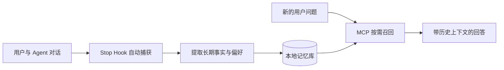

<!-- Generated from docs/content/readme-content.json by scripts/render-readme.ts. Do not edit directly. -->

# memware

[English](README.md)

**让 AI Agent 记住用户，而不是让用户反复介绍自己。**

memware 是面向 MCP 兼容 Agent 的本地优先长期记忆层。它把对话提炼为持久、可搜索的记忆，并在后续任务中召回相关上下文。记忆保存在用户自己的设备上，提取与向量化使用用户选择的 OpenAI 兼容模型接口。

> **项目状态：预发布。** 源码、测试与本地二进制构建已可用；npm 包和 GitHub Release 尚未公开发布。当前请使用下方的源码体验路径。`npx memware` 将在首次公开发布后可用。

## 为什么需要 memware

- **自动写入**: Claude Code Stop Hook 在每轮结束后自动捕获对话，不依赖模型记得调用写入工具。
- **按需召回**: 7 个 MCP 工具覆盖状态、预热、上下文召回、处理、搜索、归档与重置。
- **用户持有数据**: 结构化记忆、向量索引和审计日志都保存在本地数据目录。
- **模型服务可替换**: 提取与 Embedding 使用可配置的 OpenAI 兼容接口，不绑定单一模型供应商。



## 现在开始体验

当前版本从源码运行，需要 [Bun](https://bun.sh)、Claude Code 和一个 OpenAI 兼容接口的 API Key。

### 1. 克隆、校验并构建

```sh
git clone https://github.com/HackSing/memware.git
cd memware
bun install
bun run test
bun run typecheck
bun run memware:build
```

### 2. 注册 MCP 服务

Apple Silicon macOS:

```sh
claude mcp add memware \
  -e MEMWARE_API_KEY="$MEMWARE_API_KEY" \
  -- "$PWD/dist/memware/memware-darwin-arm64" serve
```

Linux x64:

```sh
claude mcp add memware \
  -e MEMWARE_API_KEY="$MEMWARE_API_KEY" \
  -- "$PWD/dist/memware/memware-linux-x64" serve
```

在 Claude Code 中调用 `memory_status` 验证服务状态。若使用自定义接口，还需配置 `MEMWARE_BASE_URL`、`MEMWARE_MODEL`、`MEMWARE_EMBEDDING_MODEL` 和对应的向量维度。

### 3. 打开自动记忆

将 [`packages/memware/templates/claude-settings-hooks.json`](packages/memware/templates/claude-settings-hooks.json) 合并到 Claude Code 设置，并把 [`packages/memware/templates/claude-md-snippet.md`](packages/memware/templates/claude-md-snippet.md) 加入项目 `CLAUDE.md`。完整配置、7 个工具和故障排查见 [使用文档](packages/memware/README.md)。

首次 npm 发布后，安装入口将简化为：

```sh
claude mcp add memware -e MEMWARE_API_KEY=sk-... -- npx -y memware@latest serve
```

## 适合哪些场景

| 场景 | 用户结果 |
| --- | --- |
| 长期结对开发 | 跨会话保留项目约束、个人偏好与历史决策。 |
| 多会话任务 | 新会话能够找回相关上下文，减少重复说明。 |
| 多用户 Agent | 通过 userId 隔离不同用户的记忆空间。 |
| 本地优先工作流 | 让用户搜索、审计并删除自己持有的记忆。 |

memware 不是聊天记录同步服务，也不代表原始对话只在本地处理：用于提取和向量化的文本仍会发送到你配置的模型接口。请根据数据敏感度选择服务商和部署方式。

## 产品边界

| 已具备 | 暂未提供 |
| --- | --- |
| MCP stdio 服务与 7 个记忆工具 | Windows 预构建二进制 |
| Claude Code Stop Hook 自动写入 | 托管式云同步与团队后台 |
| macOS arm64、Linux x64 本地构建 | npm 与 GitHub Release 公开分发 |
| 本地 SQLite、向量索引与审计日志 | 面向非技术用户的可视化管理界面 |

## 文档导航

- [完整使用文档](packages/memware/README.md): 工具、配置、数据与排障
- [内容运营手册](docs/CONTENT_OPERATIONS.md): 定位、节奏、证据门槛与指标
- [贡献指南](CONTRIBUTING.md): Issue、讨论、内容与代码贡献
- [安全策略](SECURITY.md): 支持范围与私密漏洞报告
- [变更记录](CHANGELOG.md): 用户可感知变化与发布状态

## 参与和持续关注

每个入口只处理一种任务：

- 遇到可复现问题，提交 [Bug](https://github.com/HackSing/memware/issues/new?template=bug_report.yml)。
- 有新的产品场景，提交 [Feature request](https://github.com/HackSing/memware/issues/new?template=feature_request.yml)。
- 文档错误或缺失，提交 [Documentation report](https://github.com/HackSing/memware/issues/new?template=documentation_report.yml)。
- 使用案例、教程和问答进入 [Discussions](https://github.com/HackSing/memware/discussions)。
- 点击 GitHub 的 **Watch → Custom → Releases** 接收有意义的版本更新。

## 开发

| 路径 | 职责 |
| --- | --- |
| `src/memware/` | serve 与 hook 两种 CLI 模式 |
| `src/agent/memory/` | 提取、路由、存储与向量搜索内核 |
| `packages/` | npm 主包与平台二进制包 |
| `scripts/` | 构建、打包与内容一致性工具 |
| `tests/` | MCP、Hook 与记忆内核测试 |

```sh
bun run test
bun run typecheck
bun run content:check
bun run memware:build
bun run memware:pack
```

memware 是采用 [MIT 许可证](LICENSE) 的开源软件。Copyright (c) 2026 Memware。
